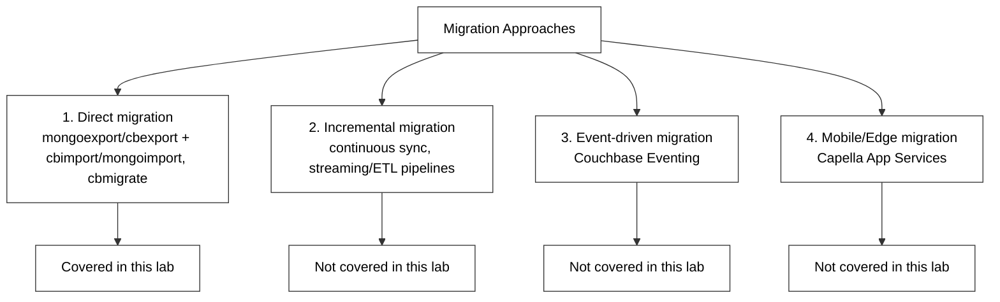
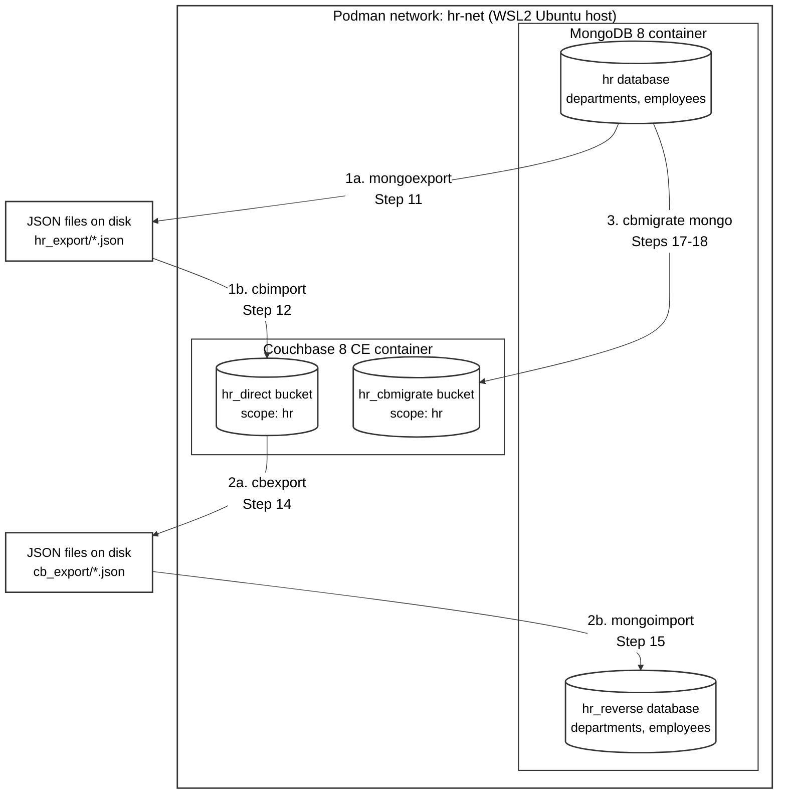

# MongoDB ⇄ Couchbase Migration Lab — Export/Import & cbmigrate

> **Platform:** WSL2 Ubuntu + Podman &nbsp;

A guided, step-by-step lab that walks through **both directions** of MongoDB ⇄ Couchbase
data movement using the simplest possible tools — no custom code required for two of
the three approaches:

1. **MongoDB → Couchbase** using `mongoexport` + `cbimport`
2. **Couchbase → MongoDB** using `cbexport` + `mongoimport`
3. **MongoDB → Couchbase** using Couchbase's official **`cbmigrate`** tool (single command)

Each approach is timed for a simple **performance comparison**, and every migration is
validated from both the **CLI** and the **GUI**.

> This lab covers the three **direct/bulk** migration approaches above. Other migration
> approaches (incremental, event-driven, mobile/edge) exist and are summarized for
> context in the next section, but are outside the scope of this lab.

---

## 1. RDBMS-to-NoSQL Terminology Map

In general, for anyone coming from an RDBMS background (Oracle/PostgreSQL), here's the
same concept in three worlds before we touch a single command:

| Oracle / PostgreSQL      | MongoDB                     | Couchbase                              |
|---------------------------|------------------------------|------------------------------------------|
| Database                  | Database                     | Bucket                                    |
| Schema                    | *(no equivalent)*            | Scope                                     |
| Table                     | Collection                   | Collection                                |
| Row                       | Document                     | Document (JSON)                           |
| Column                    | Field                        | Field                                     |
| Primary Key               | `_id`                        | Document Key (`META().id`)                |
| Index                     | Index                        | GSI (Global Secondary Index)              |
| SQL                       | MQL (`db.coll.find()`)       | SQL++ / N1QL (`SELECT ... FROM`)          |
| `exp`/`imp` / `pg_dump`   | `mongoexport` / `mongoimport`| `cbexport` / `cbimport`                   |
| Data Pump                 | `mongodump` / `mongorestore` | `cbbackup` / `cbrestore`                  |

Keep this table handy — every step below maps back to one of these familiar concepts.

---

## 2. Migration Approaches at a Glance



| Approach | Tools | Best Fit |
|---|---|---|
| **Direct migration** | `mongoexport`/`cbimport`, `cbexport`/`mongoimport`, **cbmigrate** | Small datasets, PoCs, downtime acceptable — **this lab** |
| Incremental migration | Streaming/ETL pipelines (e.g. Kafka connectors) | Large datasets, production, near-zero downtime |
| Event-driven migration | Couchbase Eventing | Schema transformation during move |
| Mobile/Edge migration | Capella App Services | Offline-first mobile/IoT apps |

---

## 3. Illustrative Business Scenarios — Which Direction Fits?

These are general architecture decision drivers, not case studies of specific named
companies — use them as talking points when explaining "why would anyone migrate
*this* way?" to freshers.

### MongoDB → Couchbase (this lab's primary direction)

| Driver | Why Couchbase fits |
|---|---|
| Sub-millisecond key-value lookups at scale | Couchbase is memory-first; acts as its own cache layer (no separate Redis needed) |
| SQL-literate BI/reporting teams | SQL++ (N1QL) reads much closer to SQL than MQL |
| Independent scaling of workloads | Data, Index, Query, Search, and Analytics services scale independently |
| Mobile/offline-first apps | Native sync via Capella App Services / Sync Gateway |
| Multi-datacenter active-active replication | Built-in XDCR |

**Typical use case:** high-traffic e-commerce product catalogs, gaming leaderboards,
session stores, and retail personalization where read latency and built-in caching
matter more than flexible ad hoc schema evolution.

### Couchbase → MongoDB

| Driver | Why MongoDB fits |
|---|---|
| Rich, mature aggregation framework | Complex analytics pipelines are a first-class MQL feature |
| Large open-source ecosystem & ODMs | Mongoose, Spring Data MongoDB, huge community/tutorial base |
| Event-driven microservices | Native Change Streams |
| Fast-moving schema evolution | Very permissive, ad hoc document shapes |
| Fully managed multi-cloud | MongoDB Atlas across AWS/Azure/GCP |

**Typical use case:** content management systems, fast-iterating startups, and teams
that want the largest available pool of developers already fluent in MongoDB tooling.

---

## 4. Real-World Adoption Snapshot (2026)

A quick "who actually uses this" reality check for the class — figures below are drawn
from each vendor's own published customer stories and press releases where possible.

**Couchbase** is trusted by over 30% of the Fortune 100, spanning financial services,
gaming, retail, and travel/hospitality.

| Company | Industry | Use Case |
|---|---|---|
| FICO | Financial Services | Falcon Fraud Manager — sub-1ms response times, 24×365 uptime |
| Viber | Communications | 15B+ daily calling/messaging events, 60% fewer servers after migrating |
| Lotum | Gaming | 800M+ app downloads, offline-first sync via Capella |
| Quantic | Retail / POS Tech | 50% faster querying for its point-of-sale platform on Capella |

**MongoDB** reports roughly 59,000 customers worldwide (2025) and is commonly cited
among the database choices at large enterprises including Accenture, IBM, Deloitte,
Siemens, and DHL. Recent AI-focused adopters spotlighted by MongoDB itself include:

| Company | Industry | Use Case |
|---|---|---|
| Zomato | Food Delivery / CX Tech | AI-native support platform handling 15M conversations/month on Atlas |
| Tavily | AI Infrastructure | Low-latency web-context retrieval for LLM agents |
| DevRev | SaaS | Centralizing CRM, support, and engineering data on one platform |
| Rierino | Enterprise Automation | Workflow orchestration built on MongoDB |

These are illustrative snapshots, not exhaustive lists — both databases have far larger
customer bases than shown here.

---

## 5. Lab Architecture



**How to read this diagram:**

- The outer box is the single Podman bridge network (`hr-net`) created in Step 3 — both
  containers live inside it and reach each other by container name.
- There are only **two containers** total: one MongoDB container (running two logical
  databases, `hr` and `hr_reverse`) and one Couchbase container (running two buckets,
  `hr_direct` and `hr_cbmigrate`). The four cylinder shapes represent those four
  databases/buckets, not four separate containers.
- **Flow 1 (top path):** `hr` is exported to JSON on disk with `mongoexport`, then that
  JSON is loaded into the `hr_direct` bucket with `cbimport`. This is Approach 1.
- **Flow 2 (middle path):** the data that now sits in `hr_direct` is exported back out to
  JSON with `cbexport`, then loaded into a **new** MongoDB database, `hr_reverse`, with
  `mongoimport` — proving the round trip works. This is Approach 2.
- **Flow 3 (bottom path):** `cbmigrate` reads directly from `hr` and writes directly into
  the `hr_cbmigrate` bucket in one command, with no intermediate JSON file. This is
  Approach 3.
- All three flows start from the same source data (`hr`), so their results can be
  compared side by side in the performance and validation steps later in this lab.

---

## Environment

| Component        | Version |
|-------------------|---------|
| WSL Ubuntu         | 22.04+  |
| Podman             | Latest  |
| MongoDB            | 8.x     |
| Couchbase Community| 8.x     |
| cbmigrate          | 1.0.2   |
| Python             | 3.12    |

> **Note:** Credentials in this lab (`Password123`) are for local training only.

---

## Prerequisites

- WSL 2 with Ubuntu 22.04 or later
- At least 2 GB free RAM
- Internet access (WSL) to pull container images and the `cbmigrate` binary

---

# Step 1 — Install Podman on WSL Ubuntu

```bash
sudo apt update
sudo apt install -y podman
podman --version
```

Podman on WSL2 works best with systemd enabled. Check if it's already on:

```bash
ps -p 1 -o comm=
```

If that does **not** print `systemd`, enable it:

```bash
cat > /tmp/wsl.conf << 'EOF'
[boot]
systemd=true
EOF
sudo cp /tmp/wsl.conf /etc/wsl.conf
```

Then, from **Windows PowerShell** (not inside WSL):

```powershell
wsl --shutdown
```

Reopen your WSL Ubuntu terminal and confirm:

```bash
ps -p 1 -o comm=
# systemd
```

---

# Step 2 — Verify Podman

```bash
podman info --format '{{.Host.Arch}} {{.Host.Distribution.Distribution}}'
podman run --rm hello-world
```

You should see Podman's "Hello from Podman" confirmation message.

---

# Step 3 — Create Podman Network

```bash
podman network create hr-net
podman network ls
```

---

# Step 4 — Start MongoDB Container

```bash
podman run -d \
  --name mongodb \
  --network hr-net \
  -p 27017:27017 \
  docker.io/library/mongo:8
```

Verify:

```bash
podman ps
```

---

# Step 5 — Start Couchbase Container

```bash
podman run -d \
  --name couchbase \
  --network hr-net \
  -p 8091-8096:8091-8096 \
  -p 11210:11210 \
  docker.io/couchbase:community
```

Verify:

```bash
podman ps
```

**Couchbase port reference** — every port mapped above serves a distinct service:

| Port  | Service            | Usage                                     |
|-------|---------------------|--------------------------------------------|
| 8091  | Admin UI             | Web console for managing Couchbase         |
| 8092  | Views                | Legacy MapReduce views                     |
| 8093  | Query                | SQL++ (N1QL) queries                       |
| 8094  | Full Text Search     | Text indexing & search                     |
| 8095  | Analytics            | Complex analytical queries                 |
| 8096  | Eventing             | Event-driven functions                     |
| 11210 | Data (KV)            | Core document storage & retrieval          |

---

# Step 6 — Configure the Couchbase Cluster (GUI or CLI)

Pick whichever path suits the audience — both end up in the same state. The GUI is
more intuitive for a first look at Couchbase; the CLI is faster to repeat and script,
and is closer to what an Oracle/PostgreSQL DBA is used to running from a terminal.

## Option A — GUI

Open:

```
http://localhost:8091
```

Select **Setup New Cluster**:

```
Cluster Name : hr-lab
Username     : Administrator
Password     : Password123
```

**Create two buckets** (Settings → Buckets → Add Bucket):

```
Bucket 1 : hr_direct       RAM Quota: 256 MB   (used by Approach 1 & 2)
Bucket 2 : hr_cbmigrate    RAM Quota: 256 MB   (used by Approach 3)
```

## Option B — CLI (`couchbase-cli`)

`couchbase-cli` ships inside the Couchbase container, so everything runs via
`podman exec`.

**Initialize the cluster:**

```bash
podman exec couchbase couchbase-cli cluster-init \
  --cluster-username Administrator \
  --cluster-password Password123 \
  --cluster-ramsize 256 \
  --cluster-index-ramsize 256 \
  --services data,index,query
```

**Create the two buckets:**

```bash
podman exec couchbase couchbase-cli bucket-create \
  --cluster localhost \
  --username Administrator \
  --password Password123 \
  --bucket hr_direct \
  --bucket-type couchbase \
  --bucket-ramsize 100 \
  --bucket-replica 0 \
  --enable-flush 1 \
  --storage-backend couchstore

podman exec couchbase couchbase-cli bucket-create \
  --cluster localhost \
  --username Administrator \
  --password Password123 \
  --bucket hr_cbmigrate \
  --bucket-type couchbase \
  --bucket-ramsize 100 \
  --bucket-replica 0 \
  --enable-flush 1 \
  --storage-backend couchstore
```

Verify either path with:

```bash
podman exec couchbase couchbase-cli bucket-list \
  --cluster localhost \
  --username Administrator \
  --password Password123
```

---

# Step 7 — Create the Scope and Collections for Approach 1

`cbimport` (unlike `cbmigrate`) does **not** auto-create scopes/collections, so create
them up front — this is the closest Couchbase equivalent to `CREATE SCHEMA` / `CREATE TABLE`.

Open the Query Workbench:

```
http://localhost:8091/ui/index.html#/query/workbench
```

```sql
CREATE SCOPE hr_direct.hr;
CREATE COLLECTION hr_direct.hr.departments;
CREATE COLLECTION hr_direct.hr.employees;
```

> `hr_cbmigrate`'s scope/collections are deliberately left uncreated — Approach 3 will
> create them automatically, which is one of the things we're demonstrating.

---

# Step 8 — Python Virtual Environment

```bash
mkdir -p ~/hr-lab && cd ~/hr-lab
python3 -m venv venv
source venv/bin/activate
pip install pymongo faker
```

---

# Step 9 — Generate the Sample HR Dataset

A classic **departments / employees** schema — instantly familiar to anyone who has
touched Oracle's `SCOTT.EMP` / `SCOTT.DEPT` or a PostgreSQL HR sample schema.

```bash
cat > generate_data.py << 'EOF'
"""
generate_data.py
Seeds MongoDB with a small, easy-to-read HR dataset:
  departments (10 docs)
  employees   (5,000 docs, each linked to a department and, mostly, a manager)
"""

import random
from datetime import datetime, timedelta
from pymongo import MongoClient
from faker import Faker

fake = Faker()
random.seed(42)
Faker.seed(42)

MONGO_URI = "mongodb://localhost:27017"
DB_NAME   = "hr"

EMPLOYEE_COUNT = 5_000

DEPARTMENTS = [
    ("DEPT01", "Human Resources",  "Chicago"),
    ("DEPT02", "Finance",          "New York"),
    ("DEPT03", "Engineering",      "Bengaluru"),
    ("DEPT04", "Sales",            "London"),
    ("DEPT05", "Marketing",        "Singapore"),
    ("DEPT06", "IT Support",       "Austin"),
    ("DEPT07", "Legal",            "Boston"),
    ("DEPT08", "Operations",       "Toronto"),
    ("DEPT09", "Customer Service", "Dublin"),
    ("DEPT10", "Research & Development", "Hyderabad"),
]

JOB_TITLES = ["CLERK", "SALESMAN", "MANAGER", "ANALYST", "PRESIDENT"]


def generate_departments():
    print(f"  Generating {len(DEPARTMENTS)} departments...")
    docs = []
    for dept_id, name, location in DEPARTMENTS:
        docs.append({
            "_id":       dept_id,
            "dept_name": name,
            "location":  location,
            "budget":    round(random.uniform(200_000, 2_000_000), 2),
        })
    return docs


def generate_employees(n, dept_ids):
    print(f"  Generating {n:,} employees...")
    docs = []
    for i in range(1, n + 1):
        emp_id = f"EMP{i:05d}"
        # first 10 employees are leadership -- no manager
        manager_id = None if i <= 10 else f"EMP{random.randint(1, min(i - 1, 200)):05d}"
        docs.append({
            "_id":        emp_id,
            "first_name": fake.first_name(),
            "last_name":  fake.last_name(),
            "job_title":  random.choice(JOB_TITLES),
            "salary":     round(random.uniform(35_000, 150_000), 2),
            "hire_date":  fake.date_between(start_date="-10y", end_date="today").isoformat(),
            "dept_id":    random.choice(dept_ids),
            "manager_id": manager_id,
        })
    return docs


def main():
    print("=" * 50)
    print("  Data Generation -- MongoDB (HR schema)")
    print("=" * 50)

    client = MongoClient(MONGO_URI)
    db = client[DB_NAME]
    db.departments.drop()
    db.employees.drop()

    departments = generate_departments()
    db.departments.insert_many(departments)
    dept_ids = [d["_id"] for d in departments]

    employees = generate_employees(EMPLOYEE_COUNT, dept_ids)
    for i in range(0, len(employees), 1_000):
        db.employees.insert_many(employees[i:i + 1_000])

    db.employees.create_index("dept_id", name="idx_employees_dept_id")

    print("\nData Generation Complete")
    print("-" * 50)
    print(f"  departments : {db.departments.count_documents({}):>6,}")
    print(f"  employees   : {db.employees.count_documents({}):>6,}")
    print("=" * 50)


if __name__ == "__main__":
    main()
EOF
```

Run it:

```bash
python generate_data.py
```

Expected output:

```
==================================================
  Data Generation -- MongoDB (HR schema)
==================================================
  Generating 10 departments...
  Generating 5,000 employees...

Data Generation Complete
--------------------------------------------------
  departments :     10
  employees   :  5,000
==================================================
```

---

# Step 10 — Verify Seed Data in MongoDB (CLI)

```bash
podman exec -it mongodb mongosh
```

```javascript
use hr
db.departments.countDocuments()   // 10
db.employees.countDocuments()     // 5000
db.employees.findOne()
db.employees.find().limit(3)
db.departments.find().pretty()
exit
```

---

# Approach 1 — `mongoexport` → `cbimport`

The classic one-time bulk copy: dump MongoDB to JSON, load the JSON into Couchbase.

## Step 11 — Export MongoDB Collections with `mongoexport`

`mongoexport` ships inside the official Mongo container image, so run it via `podman exec`.

```bash
mkdir -p ~/hr-lab/hr_export

time podman exec mongodb mongoexport \
  --uri="mongodb://localhost:27017" \
  --db=hr --collection=departments \
  --out=/tmp/departments.json

time podman exec mongodb mongoexport \
  --uri="mongodb://localhost:27017" \
  --db=hr --collection=employees \
  --out=/tmp/employees.json

podman cp mongodb:/tmp/departments.json ~/hr-lab/hr_export/departments.json
podman cp mongodb:/tmp/employees.json ~/hr-lab/hr_export/employees.json
```

> By default (no `--jsonArray`), `mongoexport` writes **one JSON document per line** —
> which happens to be exactly the `lines` format `cbimport` expects. No conversion needed.

Peek at the file:

```bash
head -2 ~/hr-lab/hr_export/employees.json
```

```json
{"_id":"EMP00001","first_name":"...","last_name":"...","job_title":"CLERK","salary":54210.5,"hire_date":"2019-03-11","dept_id":"DEPT03","manager_id":null}
```

## Step 12 — Import into Couchbase with `cbimport`

> You'll first need to copy the exported files into the Couchbase container, since
> `cbimport` reads from its own filesystem:
> ```bash
> podman cp ~/hr-lab/hr_export/departments.json couchbase:/tmp/departments.json
> podman cp ~/hr-lab/hr_export/employees.json couchbase:/tmp/employees.json
> ```
> Run this **before** the two `cbimport` commands below.

```bash
time podman exec couchbase /opt/couchbase/bin/cbimport json \
  --cluster couchbase://localhost \
  --username Administrator --password 'Password123' \
  --bucket hr_direct \
  --scope-collection-exp hr.departments \
  --format lines \
  --generate-key %_id% \
  --dataset file:///tmp/departments.json

time podman exec couchbase /opt/couchbase/bin/cbimport json \
  --cluster couchbase://localhost \
  --username Administrator --password 'Password123' \
  --bucket hr_direct \
  --scope-collection-exp hr.employees \
  --format lines \
  --generate-key %_id% \
  --dataset file:///tmp/employees.json
```

## Step 13 — Validate Approach 1

**CLI:**

```bash
podman exec couchbase /opt/couchbase/bin/cbq \
  -u Administrator -p Password123 \
  -s "CREATE PRIMARY INDEX ON hr_direct.hr.employees;"

podman exec couchbase /opt/couchbase/bin/cbq \
  -u Administrator -p Password123 \
  -s "CREATE PRIMARY INDEX ON hr_direct.hr.departments;"

podman exec couchbase /opt/couchbase/bin/cbq \
  -u Administrator -p Password123 \
  -s "SELECT COUNT(*) AS cnt FROM hr_direct.hr.employees;"

podman exec couchbase /opt/couchbase/bin/cbq \
  -u Administrator -p Password123 \
  -s "SELECT COUNT(*) AS cnt FROM hr_direct.hr.departments;"
```

> **Why one statement per command?** `cbq -s`/`--script` runs exactly **one** N1QL
> statement per call — passing several semicolon-separated statements in a single `-s`
> string causes a `syntax error ... at: CREATE (reserved word)`, because the parser
> tries to read the whole block as one statement. Run each statement as its own
> `cbq -s "..."` call, as above.

Expected: `employees = 5000`, `departments = 10`.

**GUI:** `http://localhost:8091/ui/index.html#/documents` → bucket `hr_direct` → scope
`hr` → browse `departments` and `employees`, confirm document keys equal the original
`_id` values (e.g. `EMP00001`).

---

# Approach 2 — `cbexport` → `mongoimport` (Reverse Direction)

Now flow data the other way: export what we just loaded into Couchbase, and bring it
back into a **new** MongoDB database to prove round-trip fidelity.

## Step 14 — Export Couchbase Collections with `cbexport`

```bash
podman exec couchbase mkdir -p /tmp/cb_export

time podman exec couchbase /opt/couchbase/bin/cbexport json \
  --cluster couchbase://localhost \
  --username Administrator --password 'Password123' \
  --bucket hr_direct \
  --format lines \
  --include-data hr.departments \
  --scope-field scope \
  --collection-field collection \
  --include-key doc_key \
  --output /tmp/cb_export/departments.json

time podman exec couchbase /opt/couchbase/bin/cbexport json \
  --cluster couchbase://localhost \
  --username Administrator --password 'Password123' \
  --bucket hr_direct \
  --format lines \
  --include-data hr.employees \
  --scope-field scope \
  --collection-field collection \
  --include-key doc_key \
  --output /tmp/cb_export/employees.json
```

> **Flag notes:**
> - `--include-data hr.departments` (not `--collection-string-list`, which doesn't
>   exist) limits the export to one scope.collection — the format is a comma separated
>   `scope1.collection1,scope2.collection2` list.
> - `--scope-field` and `--collection-field` are **required** whenever you export from a
>   bucket with non-default scopes/collections (ours is `hr_direct.hr`, not
>   `_default._default`). They add a `scope` and `collection` field to every exported
>   document so you know where each one came from.
> - `--include-key doc_key` adds a `doc_key` field to each exported document holding the
>   Couchbase document key — a good teaching moment: exported data isn't always a
>   byte-for-byte copy of the source, tooling adds its own metadata fields.

Copy the files out to the host, then into the MongoDB container:

```bash
mkdir -p ~/hr-lab/cb_export
podman cp couchbase:/tmp/cb_export/departments.json ~/hr-lab/cb_export/departments.json
podman cp couchbase:/tmp/cb_export/employees.json ~/hr-lab/cb_export/employees.json

podman cp ~/hr-lab/cb_export/departments.json mongodb:/tmp/departments_reverse.json
podman cp ~/hr-lab/cb_export/employees.json mongodb:/tmp/employees_reverse.json
```

## Step 15 — Import into MongoDB with `mongoimport`

```bash
time podman exec mongodb mongoimport \
  --uri="mongodb://localhost:27017" \
  --db=hr_reverse --collection=departments \
  --file=/tmp/departments_reverse.json

time podman exec mongodb mongoimport \
  --uri="mongodb://localhost:27017" \
  --db=hr_reverse --collection=employees \
  --file=/tmp/employees_reverse.json
```

## Step 16 — Validate Approach 2

**CLI:**

```bash
podman exec -it mongodb mongosh --quiet --eval '
  var db = db.getSiblingDB("hr_reverse");
  print("departments: " + db.departments.countDocuments());
  print("employees: "   + db.employees.countDocuments());
  printjson(db.employees.findOne());
'
```

> **Why not `use hr_reverse;`?** `use <db>` is a shell **helper**, not real JavaScript —
> it only works properly in the interactive `mongosh` REPL. Inside a `--eval` script it
> prints the "switched to db" confirmation and then the script quietly stops, so nothing
> after it runs. `db.getSiblingDB("hr_reverse")` is real JavaScript and works reliably
> inside `--eval` — the same pattern used later in Step 21.

Expected: `departments = 10`, `employees = 5000`, and each document now carries three
extra fields added by `cbexport`: `doc_key` (the original Couchbase document key),
`scope`, and `collection`.

**GUI (optional):** if you have MongoDB Compass on the Windows host, connect to
`mongodb://localhost:27017`, open `hr_reverse`, and browse both collections.

---

# Approach 3 — `cbmigrate` (Direct Tool-Based Migration)

A single command per collection, no intermediate files, and automatic scope/collection
creation.

## Step 17 — Install `cbmigrate`

```bash
cd ~/hr-lab
curl -sL -o cbmigrate.tar.gz \
  https://github.com/couchbaselabs/cbmigrate/releases/download/v1.0.2/cbmigrate_1.0.2_linux_amd64.tar.gz
tar -xzf cbmigrate.tar.gz
chmod +x cbmigrate
./cbmigrate --version
```

## Step 18 — Run `cbmigrate`

```bash
time ./cbmigrate mongo \
  --mongodb-uri "mongodb://localhost:27017" \
  --mongodb-database hr \
  --mongodb-collection departments \
  --cb-cluster couchbase://localhost \
  --cb-username Administrator --cb-password 'Password123' \
  --cb-bucket hr_cbmigrate \
  --cb-scope hr \
  --cb-collection departments

time ./cbmigrate mongo \
  --mongodb-uri "mongodb://localhost:27017" \
  --mongodb-database hr \
  --mongodb-collection employees \
  --cb-cluster couchbase://localhost \
  --cb-username Administrator --cb-password 'Password123' \
  --cb-bucket hr_cbmigrate \
  --cb-scope hr \
  --cb-collection employees
```

> Notice there was no "create scope/collection" step for `hr_cbmigrate` — `cbmigrate`
> created `hr.departments` and `hr.employees` automatically, and also translated the
> `idx_employees_dept_id` Mongo index into a Couchbase GSI (`--copy-indexes` is `true`
> by default).

## Step 19 — Validate Approach 3

**CLI:**

```bash
podman exec couchbase /opt/couchbase/bin/cbq \
  -u Administrator -p Password123 \
  -s "SELECT COUNT(*) AS cnt FROM hr_cbmigrate.hr.employees;"

podman exec couchbase /opt/couchbase/bin/cbq \
  -u Administrator -p Password123 \
  -s "SELECT COUNT(*) AS cnt FROM hr_cbmigrate.hr.departments;"

podman exec couchbase /opt/couchbase/bin/cbq \
  -u Administrator -p Password123 \
  -s "SELECT name, state FROM system:indexes WHERE bucketId = 'hr_cbmigrate';"
```

Expected: `employees = 5000`, `departments = 10`, and `idx_employees_dept_id` (or its
translated name) in state `online`.

**GUI:** `http://localhost:8091/ui/index.html#/documents` → bucket `hr_cbmigrate` →
confirm the `hr` scope exists with both collections, and check
`http://localhost:8091/ui/index.html#/indexes` for the translated index.

---

# Step 20 — Performance Comparison

Every command above was wrapped in `time` on purpose. Fill in your own measured
values — actual numbers depend on your WSL VM's CPU/RAM allocation, so don't treat
any pre-filled numbers as gospel; record what you actually see.

| Approach | Step(s) Timed | Your `real` time |
|---|---|---|
| 1 — mongoexport | departments + employees export | ______ |
| 1 — cbimport | departments + employees import | ______ |
| **Approach 1 total** | | ______ |
| 2 — cbexport | departments + employees export | ______ |
| 2 — mongoimport | departments + employees import | ______ |
| **Approach 2 total** | | ______ |
| 3 — cbmigrate | departments + employees (single tool) | ______ |
| **Approach 3 total** | | ______ |

**Findings:**
- Approach 3 (`cbmigrate`) has no intermediate file I/O — expect it to generally beat
  the two-step export/import approaches, especially as data volume grows.
- Approaches 1 and 2 give you an inspectable JSON file mid-flight, which is useful for
  auditing/transformation but adds disk I/O and an extra process hop.
- All three approaches are one-time bulk copies — none of them keep the two databases
  in sync after the run finishes. Continuous/incremental sync is a different category
  of approach (see Section 2) and isn't covered by this lab.

---

# Step 21 — Post-Migration Functional Testing (MQL vs SQL++)

A side-by-side so the RDBMS→NoSQL translation clicks immediately.

## Filter a single department

```javascript
// MongoDB (mongosh)
use hr
db.employees.find({ dept_id: "DEPT03" }).limit(3)
```

```sql
-- Couchbase (cbq / Query Workbench)
SELECT * FROM hr_direct.hr.employees WHERE dept_id = "DEPT03" LIMIT 3;
```

## Aggregate — average salary by department

```javascript
// MongoDB
db.employees.aggregate([
  { $group: { _id: "$dept_id", avgSalary: { $avg: "$salary" }, headcount: { $sum: 1 } } },
  { $sort: { _id: 1 } }
])
```

```sql
-- Couchbase
SELECT dept_id, ROUND(AVG(salary), 2) AS avgSalary, COUNT(*) AS headcount
FROM hr_direct.hr.employees
GROUP BY dept_id
ORDER BY dept_id;
```

## Join employees to departments (the RDBMS-familiar part)

```javascript
// MongoDB -- $lookup is Mongo's answer to a SQL JOIN
db.employees.aggregate([
  { $lookup: { from: "departments", localField: "dept_id", foreignField: "_id", as: "dept" } },
  { $unwind: "$dept" },
  { $project: { _id: 1, first_name: 1, last_name: 1, "dept.dept_name": 1 } },
  { $limit: 3 }
])
```

```sql
-- Couchbase -- ANSI-style JOIN, reads almost exactly like Oracle/PostgreSQL SQL
-- (a secondary index on the join predicate keeps this fast, same as an RDBMS FK index)
CREATE INDEX idx_employees_dept_id_gsi ON hr_direct.hr.employees(dept_id);

SELECT e._id, e.first_name, e.last_name, d.dept_name
FROM hr_direct.hr.employees e
JOIN hr_direct.hr.departments d ON e.dept_id = META(d).id
LIMIT 3;
```

> This last query is the one that usually makes the "aha" moment for Oracle/PostgreSQL
> folks — SQL++ JOIN syntax is deliberately close to what you already write every day.

## Cross-target count reconciliation (all three targets)

```bash
podman exec -it mongodb mongosh --quiet --eval '
  print("hr.employees: "         + db.getSiblingDB("hr").employees.countDocuments());
  print("hr_reverse.employees: " + db.getSiblingDB("hr_reverse").employees.countDocuments());
'

podman exec couchbase /opt/couchbase/bin/cbq \
  -u Administrator -p Password123 \
  -s "SELECT 'hr_direct' AS src, COUNT(*) AS cnt FROM hr_direct.hr.employees
      UNION ALL
      SELECT 'hr_cbmigrate' AS src, COUNT(*) AS cnt FROM hr_cbmigrate.hr.employees;"
```

> **Why `AS src` and not `AS bucket`?** `bucket` is itself a reserved keyword in N1QL /
> SQL++ (it's part of the DDL syntax), so using it as a column alias causes the same kind
> of `syntax error ... reserved word` you'd get trying to name a PL/SQL column `table` or
> `select`. Any non-reserved alias — `src`, `source_name`, etc. — works fine.

All four numbers (`hr.employees`, `hr_reverse.employees`, `hr_direct` src,
`hr_cbmigrate` src) should read **5000**.

---

# Validation Checklist

- [ ] Podman installed and `podman run --rm hello-world` succeeds
- [ ] `mongodb` and `couchbase` containers both `Up` (`podman ps`)
- [ ] Couchbase cluster initialized; buckets `hr_direct` and `hr_cbmigrate` created
- [ ] `hr_direct.hr` scope and its two collections created manually (Step 7)
- [ ] MongoDB seeded: `departments = 10`, `employees = 5000`
- [ ] **Approach 1:** `mongoexport` produced two JSON files; `cbimport` loaded both into `hr_direct`
- [ ] **Approach 1:** counts match source (`5000` / `10`) via CLI and GUI
- [ ] **Approach 2:** `cbexport` produced two JSON files with a `doc_key` field; `mongoimport` loaded both into `hr_reverse`
- [ ] **Approach 2:** counts match source (`5000` / `10`) via CLI (GUI optional)
- [ ] **Approach 3:** `cbmigrate` auto-created the `hr` scope and both collections in `hr_cbmigrate`
- [ ] **Approach 3:** counts match source and the Mongo index was translated to an online GSI
- [ ] Performance table (Step 20) filled in with your own measured times
- [ ] MQL vs SQL++ filter, aggregate, and join queries (Step 21) all return matching results
- [ ] Cross-target count reconciliation (Step 21) shows `5000` everywhere
- [ ] Cleanup executed and `podman ps -a` / `podman network ls` show no leftover lab objects

---

# Step 22 — Cleanup

```bash
cat > cleanup.sh << 'EOF'
#!/bin/bash
# cleanup.sh -- remove every object created for this lab.

echo "Stopping containers..."
podman stop mongodb couchbase 2>/dev/null || true

echo "Removing containers..."
podman rm mongodb couchbase 2>/dev/null || true

echo "Removing network..."
podman network rm hr-net 2>/dev/null || true

echo "Removing cbmigrate binary and archive..."
rm -f cbmigrate cbmigrate.tar.gz

echo "Removing exported JSON files..."
rm -rf hr_export cb_export

echo "Removing Python virtual environment..."
rm -rf venv

echo "Cleanup complete."
EOF

chmod +x cleanup.sh
./cleanup.sh
```

> **Still see `(venv)` in your prompt after this runs?** That's expected — `cleanup.sh`
> runs in its own subshell, so a `deactivate` call inside the script can't reach back and
> change *your* interactive shell's environment. Deleting the `venv` folder also doesn't
> undo `source venv/bin/activate`; the shell keeps the venv's environment variables (and
> the `(venv)` prompt prefix) loaded in memory regardless of whether the folder still
> exists. Run this yourself, directly in your terminal, once the script finishes:
> ```bash
> deactivate
> ```
> Your prompt should drop back to normal immediately.

Remove the project directory:

```bash
cd ~
rm -rf ~/hr-lab
```

---

## Learning Outcomes

- Installing and configuring Podman on WSL2 Ubuntu, including systemd setup
- Running MongoDB and Couchbase side by side in a Podman bridge network
- Exporting/importing data with native tools in **both directions**:
  `mongoexport`/`cbimport` and `cbexport`/`mongoimport`
- Using Couchbase's official `cbmigrate` CLI for single-command direct migration
- The practical difference between manually creating scopes/collections (`cbimport`)
  and automatic creation (`cbmigrate`)
- Reading and comparing `time`-based performance measurements across three approaches
- Mapping familiar RDBMS concepts (database, schema, table, row, index, SQL) onto
  MongoDB and Couchbase equivalents
- Writing and comparing equivalent MQL and SQL++ queries, including an ANSI-style JOIN
- Full environment cleanup with a single script
